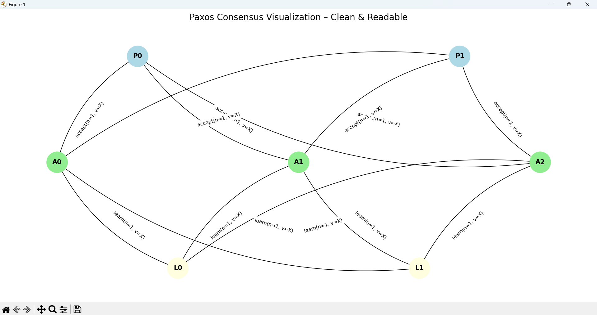

# Paxos Consensus Implementation for Investment Simulation

This module implements a simulation of the **Paxos distributed consensus algorithm** as part of the `investment-p` project. It includes both the core algorithm and a visual representation of how Paxos nodes (proposers, acceptors, and learners) communicate to reach consensus.

---

## 📁 Folder Structure

```
market_sim/
├── analysis/
│   └── visualization/
│       ├── __init__.py
│       └── paxos_graph.py         # Paxos visualization
├── blockchain/
│   └── consensus/
│       ├── __init__.py
│       ├── paxos.py               # Paxos roles and logic
│       └── simulation.py          # Simulates Paxos message flow
├── tests/
│   └── integration/
│       ├── __init__.py
│       ├── test_paxos.py          # Integration test for Paxos
│       └── test_market_making.py
```

---

## ✅ What's Included

- **`paxos.py`**:
  - Implements core Paxos roles: `Proposer`, `Acceptor`, `Learner`
- **`simulation.py`**:
  - Simulates message-passing behavior among the roles
- **`paxos_graph.py`**:
  - Visualizes the Paxos protocol interactions using NetworkX and Matplotlib
- **`test_paxos.py`**:
  - Basic integration tests for correctness of Paxos message flow

---

## 🚀 Running Instructions

### 🔧 1. Install Dependencies

```bash
pip install matplotlib networkx
```

### ▶️ 2. Run Paxos Simulation

```bash
python market_sim/blockchain/consensus/simulation.py
```

### 📊 3. Run Paxos Visualization

```bash
python market_sim/analysis/visualization/paxos_graph.py
```

This generates a network graph showing:
- Proposer sending proposals
- Acceptors voting
- Learners learning the value

---

## 🧪 Running Tests

From the project root:

```bash
pytest market_sim/tests/integration/test_paxos.py -v
```

This will run basic tests on proposer → acceptor → learner flow logic.

---

## 🔍 Example Output

```
P0 proposes value: 42
A0 accepts value: 42
A1 accepts value: 42
L0 learns value: 42
L1 learns value: 42
```

And the visualization will display nodes and messages between Proposers (P), Acceptors (A), and Learners (L).

